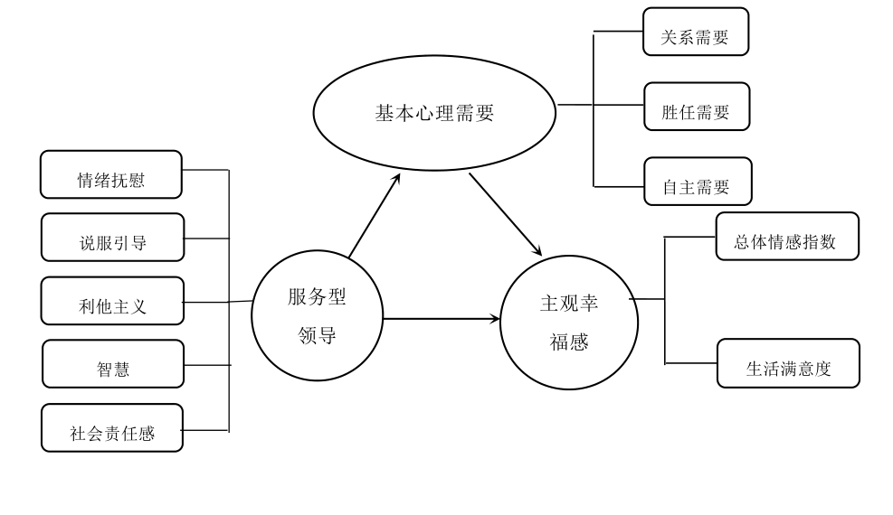

# 数据说明及描述性统计 {#method}


```{r, message=FALSE, warning=FALSE, echo=FALSE}
library(tidyverse)
library(gtsummary)
library(flextable)

well <- read_rds("./rawdata/well.rds")
```

## 理论模型

在国内外学者的研究基础上，提出了服务型领导、基本心理需要与员工主观幸福感的关系：服务型领导是影响变量，结果变量和中介变量分别是员工主观幸福感以及基本心理需求。同时，这三个变量也包含不同的维度。主观幸福感包括五个维度：情绪抚慰、说服引导、利他主义、智慧、社会责任感；基本心理需求包括三个维度：关系需要、胜任需要和自主需要；员工主观幸福感包括两个维度：总体情感指数和生活满意度。通过已有的研究，本文梳理了主观幸福感、基本心理需要和员工主观幸福感三个变量之间的关系，并构建了本文所研究变量之间的关系模型，如图 \@ref(fig:fig-mindmap) 所示。


```{r fig-mindmap, out.width= "95%", fig.cap = "本文理论模型"}

```


## 研究假设

针对服务型领导自身的五个不同维度（如社会责任感、智慧、利他主义、说服引导以及情绪抚慰等）展开深入的分析讨论，在实际工作中领导的情绪抚慰、说服引导和利他主义能够提高员工的积极情绪、自尊心和组织认可度，对提升幸福感有明显效果，酒店作为服务行业，工作内容非常繁琐，工作氛围比较紧张，不同顾客的接待方式也不能一概而论，时刻都是一种新的服务内容，工作负荷大，心理始终处于紧张状态，这时服务型领导就发挥着重要作用。智慧和社会责任感可以提高员工的荣誉感，让员工从内心当中愿意为企业做出一份贡献，也愿意为提高社会荣誉感而努力工作，这种发自内心的工作方式可以给员工带来不可替代的主观幸福感。综合以上分析，本文认为服务型领导能提高员工的积极情感和生活满意度，同时服务型领导能降低酒店员工的消极情感。因此提出以下假设：


## 数据来源与处理

一共发放调查问卷 260 份，经过为期 1 个多月的调查时间，实际收回调查问卷 240 份，回收率 92.3%，在除去一些答案全部为同一选项和有个别选项没有填写的无效问卷，有效问卷 218 份，占回收问卷的 90%。具体测试者分布情况如表\@ref(tab:gtsummary-tab01) 所示。在被调查对象中，男性少于女性，这和酒店行业的女性员工较多符合；调查者的年龄集中在中青年为主，其中超过 46 周岁的为 5%，从 36 周岁到 45 周岁的为 43.1%，而从 26 周岁到 35 周岁的则为 51.9%；如果站在受教育程度来分析，则占比最高的是本科，达到 66.2%，而大专学历和更低学历的员工占比为11.1%，硕士研究生占 19.9%，博士研究生占 2.8%；从加入部门的工作年限来看，每个类别的被调查者占样本总量的比例基本接近平衡；如果是站在管理者的职级来进行分析可知，高层的占比比较低，而中层以及基层员工则有比较高的占比；从收入来看，基本成正态分布，总的来说调查数据兼顾了各方面，具有一定的可信度。

```{r, tab.id='gtsummary-tab01'}
well %>% 
  select(gender:position) %>%
  tbl_summary(
    statistic = list(everything() ~ "{n} ({p}%)"),
    digits = everything() ~ c(0, 1)
  ) %>% 
  as_flex_table() %>% 
  set_caption("被测试者分布情况")
```


\newpage
