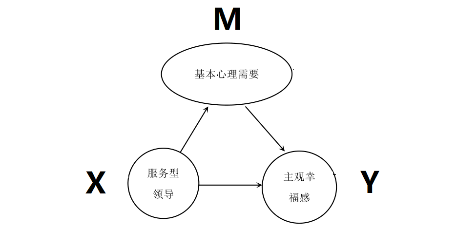

# 实证分析 {#analysis}

```{r, echo = FALSE, message=FALSE, warning=FALSE}
library(tidyverse)
library(haven)
library(gtsummary)
library(modelsummary)
library(flextable)

well <- read_rds("./rawdata/well.rds")

pairs <- readxl::read_excel("./rawdata/names.xlsx") %>% deframe()
```


## 描述性统计分析


描述性统计分析要对数据进行集趋势、离散程度等指标进行分析，更有助于研究人员发现数据的内部规律。本文在对调查数据进行整理后进行了描述性统计，得到各研究变量的均值和标准差信息，如表 \@ref(tab:table-describe) 所示。


```{r, tab.id='table-describe', label='tab4-1'}
well %>% 
  select(starts_with("total"), starts_with("dim")) %>% 
  pivot_longer(cols = everything()) %>% 
  group_by(name) %>% 
  summarise( 
    mean = mean(value),
    sd = sd(value)
  ) %>% 
  mutate(
    name = recode(name, !!!pairs)
  ) %>% 
  flextable(cwidth = 1.5) %>% 
  set_caption("描述性统计分析")
```


## 量表信度与效度分析

对问卷量表信度和效度的检验也是数据分析中一个重要的环节，数据必须具有较好的信度和效度，这样分析结果才能令人信服，具有说服力。


## 相关性分析

本文运用相关分析方法探讨了自变量与因变量关系的密切性和方向性。采用Pearson 简单相关系数确定了服务型领导、基本心理需要与主观幸福感之间的线性相关关系。皮尔逊相关系数矩阵如表 \@ref(tab:table-corr) 所示。从表中可以看出研究变量的各个维度之间均存在相关性，所有维度的相关性都超过了 0.4，这说明各变量之间存在一定关联性，这是进行相关分析的基本前提。


```{r, tab.id= 'table-corr'}
set_flextable_defaults(font.size = 9)

well %>% 
  select(starts_with("dim_")) %>% 
  cor(method = "pearson") %>% 
  as.data.frame() %>% 
  flextable() %>% 
  set_caption("各维度 Pearson 相关系数")

init_flextable_defaults()
```


我们再看看图 \@ref(fig:fig-corr)


```{r fig-corr, fig.width = 6, fig.asp = 0.8, fig.cap = "各维度 Pearson 相关系数"}
well %>%
  select(starts_with("dim_")) %>%
  ggstatsplot::ggcorrmat(
    output = "plot",
    matrix.type = "lower",
    type = "parametric",
    sig.level = 0.05,
    package = "RColorBrewer",
    palette = "OrRd",
    colors = NULL
  ) +
  theme_minimal()
```


## 回归分析

根据 Baron&Kenny（1986）的研究，检验变量间中介关系的步骤如下：第一步，检验预测变量（本文中的服务型领导）与结果变量（本文中的主观幸福感）之间是否存在显著相关，第二步，检验预测变量（本文中的服务型领导）与中介变量（本文中的基本心理需要）之间是否存在显著相关。第三步，检验预测变量（本文中的服务型领导）、中介变量（本文中的基本心理需要）与结果变量（本文中的主观幸福感）之间是否存在显著相关。如果中介变量（本文中的基本心理需要）加入预测变量（本文中的服务型领导）与结果变量（本文中的主观幸福感）的回归模型时，中介变量（本文中的基本心理需要）与结果变量（本文中的主观幸福感）之间的关系显著，预测变量对结果变量的解释程度显著降低（起部分中介效用）或完全消失（起完全中介效用），则基本心理需要的中介作用成立。本文采用逐步回归法验证基本心理需要进入回归模型后对服务型领导和主观幸福感的中介效用。如图 \@ref(fig:fig-mediate) 所示。


```{r fig-mediate, out.width= "85%", fig.cap = "中介模型"}

```


通过逐步回归法，对基本心理需要在主观幸福感和服务型领导之间所起到的中介功能展开客观且深入的验证。通过分析得到表 \@ref(tab:modelsummary-tab)


```{r, tab.id='modelsummary-tab'}
library(modelsummary)
library(flextable)
m1 <-
  list(
    "mod1" = lm(total_m ~ 1 + total_x, data = well),
    "mod2" = lm(total_y ~ 1 + total_x, data = well),
    "mod3" = lm(total_y ~ 1 + total_m + total_x, data = well)
  )

modelsummary(m1,
  fmt = 2,
  output = "flextable",
  estimate = "{estimate}{stars}",
  statistic = "{p.value}{stars}",
  title = "服务型领导与主观幸福感：基本心理需要的中介作用检验"
  ) %>% 
  autofit()
```


\newpage


